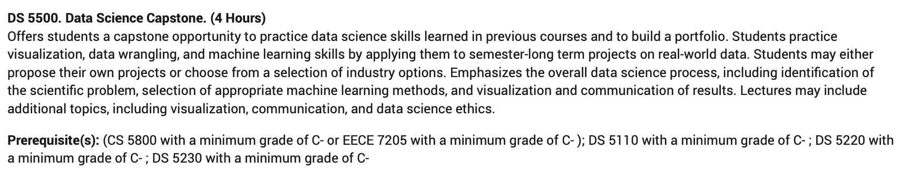

# Academic Advisor with RAG

# **Project Summary**

This project developed an automated **academic advising tool** that recommends personalized course plans based on a student’s interests or career goals. The system uses a **Retrieval-Augmented Generation** **(RAG)** pipeline built on top of the Mistral-7B Instruct model. By incorporating **course descriptions and class schedules as external context**, the model generates tailored semester plans that align with user requirements. This project showcases a scalable architecture combining dual retrievers and LLM reasoning to automate a traditionally manual academic advising process.

---

# Project Overview

### **Context**

Academic advising is often a manual, time-consuming process that requires understanding a student’s goals and matching them with relevant courses available in a given semester. To address this, the project implements a context-aware, conversational system using RAG and a large language model (Mistral-7B Instruct) to simulate an academic advisor.

### Project Diagram

.png>)

---

# Implementation - RAG

The RAG component is designed to query two external sources: the Course Description and the Class Schedule. Both sources are parsed, embedded using a HuggingFace embedding model, and stored in separate Chroma vector databases. When a user submits a query, **Retriever 1** searches the Course Description to find relevant course information based on the user’s intent. The results are then passed to **Retriever 2**, which filters the class schedule data using metadata from the previous step to identify which of the matched courses are actually offered in the current semester. This filtered context is then passed to the LLM to generate an appropriate response.

- **Example of Course Description**

- **Example of Class Schedule**

### Retriever1 - Course Catalog Search

• The catalog is parsed from a PDF file into individual course entries, each containing the course title, description, and prerequisites.
• These are embedded using a HuggingFace embedding model and stored in a Chroma vector database.
• The retriever uses Maximum Marginal Relevance (MMR) to balance relevance and diversity, returning a top-_k_ list (e.g., 7) of course entries that best match the user’s intent.

### Retriever2 - Class Schedule Filter

• Each course entry includes attributes such as meeting time, campus, term, and enrollment status, which are formatted and embedded into the Chroma database.
• The retriever only considers courses whose titles match those returned by Retriever 1.
